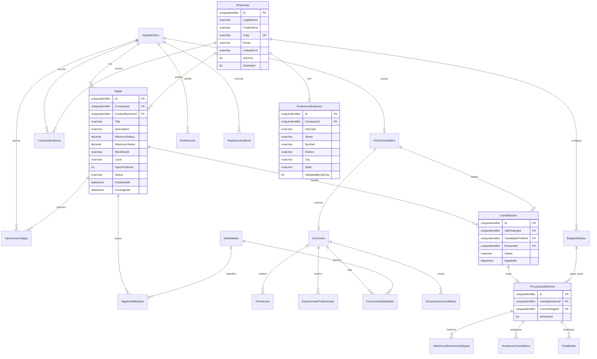

# Diagrama de Banco - JobConnect Pro

```mermaid
erDiagram
    AspNetUsers ||--o| PerfisCandidatos : possui
    AspNetUsers ||--o{ UsuariosEmpresa : vincula
    AspNetUsers ||--o{ Vagas : cria
    AspNetUsers ||--o{ Notificacoes : recebe
    AspNetUsers ||--o{ RegistrosAuditoria : executa
    AspNetUsers ||--o{ AprovacoesVagas : aprova

    Empresas ||--o| EnderecosEmpresa : tem
    Empresas ||--o{ UsuariosEmpresa : possui
    Empresas ||--o{ Vagas : publica
    Empresas ||--o{ EtapasSelecao : configura

    Vagas ||--o{ VagasHabilidades : requer
    Habilidades ||--o{ VagasHabilidades : classifica
    Vagas ||--o{ Candidaturas : recebe
    Vagas ||--o{ AprovacoesVagas : historico

    PerfisCandidatos ||--o| Curriculos : mantem
    PerfisCandidatos ||--o{ Candidaturas : realiza
    Curriculos ||--o{ Formacoes : contem
    Curriculos ||--o{ ExperienciasProfissionais : contem
    Curriculos ||--o{ CurriculosHabilidades : lista
    Habilidades ||--o{ CurriculosHabilidades : domina
    Curriculos ||--o{ DocumentosCandidatos : anexa

    Candidaturas ||--o| ProcessosSeletivos : inicia
    EtapasSelecao ||--o{ ProcessosSeletivos : etapa_atual
    ProcessosSeletivos ||--o{ HistoricosMovimentosEtapas : historico
    ProcessosSeletivos ||--o{ AvaliacoesCandidatos : avaliacoes
    ProcessosSeletivos ||--o{ Feedbacks : feedbacks

    Empresas {
        uniqueidentifier Id PK
        nvarchar LegalName
        nvarchar TradeName
        nvarchar Cnpj UK
        nvarchar Email
        nvarchar LinkedInUrl
        bit IsActive
        bit IsDeleted
    }

    EnderecosEmpresa {
        uniqueidentifier Id PK
        uniqueidentifier CompanyId FK
        nvarchar ZipCode
        nvarchar Street
        nvarchar Number
        nvarchar District
        nvarchar City
        nvarchar State
        bit ValidatedByViaCep
    }

    Vagas {
        uniqueidentifier Id PK
        uniqueidentifier CompanyId FK
        uniqueidentifier CreatedByUserId FK
        nvarchar Title
        nvarchar Description
        decimal MinimumSalary
        decimal MaximumSalary
        nvarchar WorkModel
        nvarchar Level
        int OpenPositions
        nvarchar Status
        datetime2 PublishedAt
        datetime2 ClosingDate
    }

    Candidaturas {
        uniqueidentifier Id PK
        uniqueidentifier JobPostingId FK
        uniqueidentifier CandidateProfileId FK
        uniqueidentifier ResumeId FK
        nvarchar Status
        datetime2 AppliedAt
    }

    ProcessosSeletivos {
        uniqueidentifier Id PK
        uniqueidentifier JobApplicationId FK
        uniqueidentifier CurrentStageId FK
        bit IsFinished
    }
```

