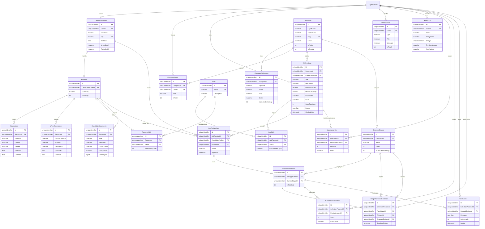

# Diagrama do Banco de Dados - JobConnect Pro

```mermaid
erDiagram
    AspNetUsers ||--o| CandidateProfiles : "possui"
    AspNetUsers ||--o{ CompanyUsers : "vincula"
    AspNetUsers ||--o{ JobPostings : "cria"
    AspNetUsers ||--o{ Notifications : "recebe"
    AspNetUsers ||--o{ AuditLogs : "executa"
    AspNetUsers ||--o{ JobApprovals : "aprova"
    AspNetUsers ||--o{ CandidateEvaluations : "avalia"
    AspNetUsers ||--o{ Feedbacks : "emite"
    AspNetUsers ||--o{ StageMovementHistories : "movimenta"

    Companies ||--o| CompanyAddresses : "tem"
    Companies ||--o{ CompanyUsers : "possui"
    Companies ||--o{ JobPostings : "publica"
    Companies ||--o{ SelectionStages : "configura"

    JobPostings ||--o{ JobSkills : "requer"
    Skills ||--o{ JobSkills : "classifica"
    JobPostings ||--o{ JobApplications : "recebe"
    JobPostings ||--o{ JobApprovals : "historico_aprovacao"

    CandidateProfiles ||--o| Resumes : "mantem"
    CandidateProfiles ||--o{ JobApplications : "realiza"
    Resumes ||--o{ Educations : "contem"
    Resumes ||--o{ WorkExperiences : "contem"
    Resumes ||--o{ ResumeSkills : "lista"
    Skills ||--o{ ResumeSkills : "domina"
    Resumes ||--o{ CandidateDocuments : "anexa"
    Resumes ||--o{ JobApplications : "usado_em"

    JobApplications ||--o| SelectionProcesses : "inicia"
    SelectionStages ||--o{ SelectionProcesses : "etapa_atual"
    SelectionProcesses ||--o{ StageMovementHistories : "historico"
    SelectionStages ||--o{ StageMovementHistories : "origem"
    SelectionStages ||--o{ StageMovementHistories : "destino"
    SelectionProcesses ||--o{ CandidateEvaluations : "avaliacoes"
    SelectionProcesses ||--o{ Feedbacks : "feedbacks"

    Companies {
        uniqueidentifier Id PK
        nvarchar LegalName
        nvarchar TradeName
        nvarchar Cnpj UK
        nvarchar Email
        bit IsActive
        bit IsDeleted
    }

    CompanyAddresses {
        uniqueidentifier Id PK
        uniqueidentifier CompanyId FK
        nvarchar ZipCode
        nvarchar Street
        nvarchar City
        nvarchar State
        bit ValidatedByViaCep
    }

    CompanyUsers {
        uniqueidentifier Id PK
        uniqueidentifier CompanyId FK
        uniqueidentifier UserId FK
        nvarchar Role
        bit IsActive
    }

    JobPostings {
        uniqueidentifier Id PK
        uniqueidentifier CompanyId FK
        uniqueidentifier CreatedByUserId FK
        nvarchar Title
        nvarchar Description
        decimal MinimumSalary
        decimal MaximumSalary
        nvarchar WorkModel
        nvarchar Level
        int OpenPositions
        nvarchar Status
        datetime2 ClosingDate
    }

    Skills {
        uniqueidentifier Id PK
        nvarchar Name UK
        nvarchar Description
    }

    JobSkills {
        uniqueidentifier Id PK
        uniqueidentifier JobPostingId FK
        uniqueidentifier SkillId FK
        nvarchar RequirementType
    }

    CandidateProfiles {
        uniqueidentifier Id PK
        uniqueidentifier UserId FK
        nvarchar FullName
        nvarchar Cpf UK
        date BirthDate
        nvarchar LinkedInUrl
        nvarchar PortfolioUrl
    }

    Resumes {
        uniqueidentifier Id PK
        uniqueidentifier CandidateProfileId FK
        nvarchar Summary
        bit IsPrimary
    }

    Educations {
        uniqueidentifier Id PK
        uniqueidentifier ResumeId FK
        nvarchar Institution
        nvarchar Course
        nvarchar Degree
        date StartDate
        date EndDate
    }

    WorkExperiences {
        uniqueidentifier Id PK
        uniqueidentifier ResumeId FK
        nvarchar CompanyName
        nvarchar Position
        nvarchar Description
        date StartDate
        date EndDate
    }

    ResumeSkills {
        uniqueidentifier Id PK
        uniqueidentifier ResumeId FK
        uniqueidentifier SkillId FK
        int ProficiencyLevel
    }

    CandidateDocuments {
        uniqueidentifier Id PK
        uniqueidentifier ResumeId FK
        nvarchar Type
        nvarchar FileName
        nvarchar ContentType
        nvarchar StoragePath
        bigint SizeInBytes
    }

    JobApplications {
        uniqueidentifier Id PK
        uniqueidentifier JobPostingId FK
        uniqueidentifier CandidateProfileId FK
        uniqueidentifier ResumeId FK
        nvarchar Status
        datetime2 AppliedAt
    }

    SelectionProcesses {
        uniqueidentifier Id PK
        uniqueidentifier JobApplicationId FK
        uniqueidentifier CurrentStageId FK
        bit IsFinished
    }

    SelectionStages {
        uniqueidentifier Id PK
        uniqueidentifier CompanyId FK
        nvarchar Name
        int Order
        bit IsDefaultInitialStage
    }

    StageMovementHistories {
        uniqueidentifier Id PK
        uniqueidentifier SelectionProcessId FK
        uniqueidentifier FromStageId FK
        uniqueidentifier ToStageId FK
        uniqueidentifier ChangedByUserId FK
        nvarchar ResultingStatus
    }

    CandidateEvaluations {
        uniqueidentifier Id PK
        uniqueidentifier SelectionProcessId FK
        uniqueidentifier EvaluatorUserId FK
        int Score
        nvarchar Comments
    }

    Feedbacks {
        uniqueidentifier Id PK
        uniqueidentifier SelectionProcessId FK
        uniqueidentifier CreatedByUserId FK
        nvarchar Message
        bit IsAutomatic
        datetime2 SentAt
    }

    Notifications {
        uniqueidentifier Id PK
        uniqueidentifier UserId FK
        nvarchar Type
        nvarchar Title
        nvarchar Message
        bit IsRead
    }

    AuditLogs {
        uniqueidentifier Id PK
        uniqueidentifier UserId FK
        nvarchar Action
        nvarchar EntityName
        uniqueidentifier EntityId
        nvarchar PreviousValues
        nvarchar NewValues
    }

    JobApprovals {
        uniqueidentifier Id PK
        uniqueidentifier JobPostingId FK
        uniqueidentifier ApprovedByUserId FK
        bit Approved
        nvarchar Notes
    }
```
