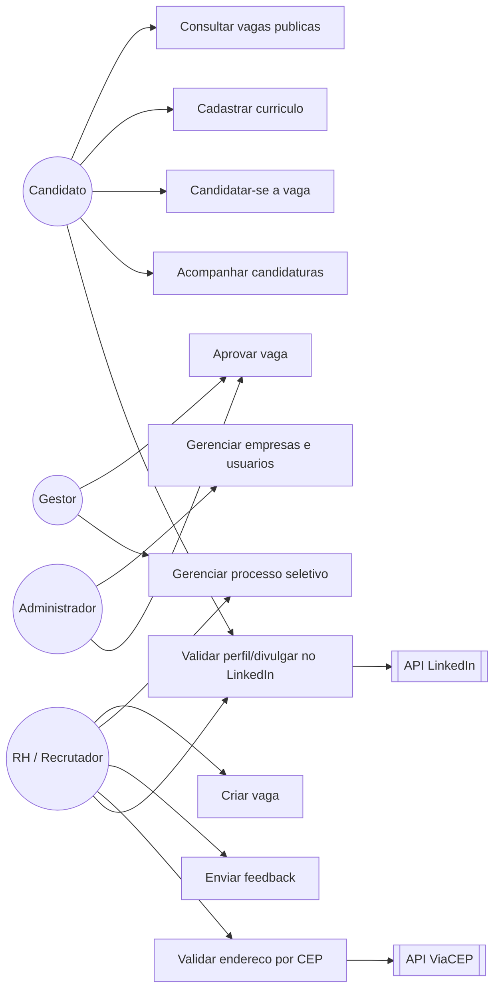

# Diagrama de Casos de Uso - JobConnect Pro

```mermaid
flowchart LR
    Candidato((Candidato))
    Recrutador((RH / Recrutador))
    Gestor((Gestor))
    Admin((Administrador))
    ViaCEP[[API ViaCEP]]
    LinkedIn[[API LinkedIn]]

    UC1[Consultar vagas publicas]
    UC2[Cadastrar curriculo]
    UC3[Candidatar-se a vaga]
    UC4[Acompanhar candidaturas]
    UC5[Criar vaga]
    UC6[Aprovar vaga]
    UC7[Gerenciar processo seletivo]
    UC8[Enviar feedback]
    UC9[Gerenciar empresas e usuarios]
    UC10[Validar endereco por CEP]
    UC11[Validar perfil/divulgar no LinkedIn]

    Candidato --> UC1
    Candidato --> UC2
    Candidato --> UC3
    Candidato --> UC4
    Candidato --> UC11

    Recrutador --> UC5
    Recrutador --> UC7
    Recrutador --> UC8
    Recrutador --> UC10
    Recrutador --> UC11

    Gestor --> UC6
    Gestor --> UC7

    Admin --> UC9
    Admin --> UC6

    UC10 --> ViaCEP
    UC11 --> LinkedIn
```

